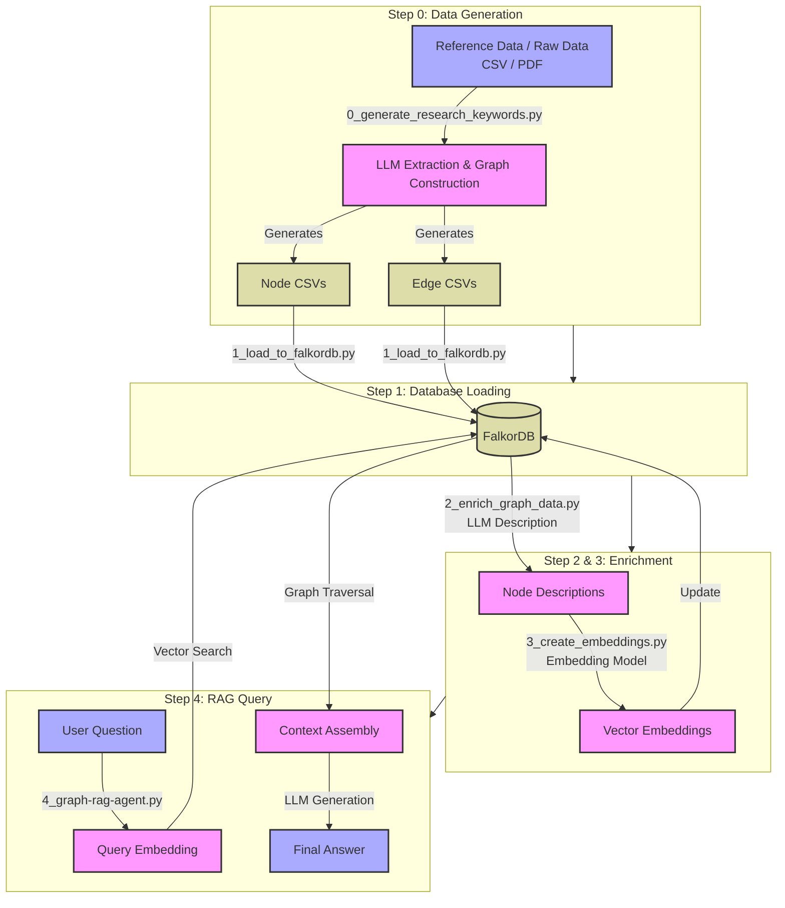

# FalkorDB GraphRAG System

A comprehensive GraphRAG system for knowledge graph construction and querying using FalkorDB and Local LLM.

## 📁 File Structure

### Core Pipeline Scripts

**Graph Generation (NEW - LLM-Driven)**

1. **`0_graph_schema_discovery.py`** - Automatic graph generation from raw data

- Analyzes raw data using LLM
- Discovers Node/Edge schema automatically
- Extracts entities and relationships
- **See `GRAPH_GENERATOR_README.md` for details**

1. **`0_generate_research_keywords.py`** - Scientific Paper Analysis & Graph Construction
   - **Sophisticated Graph Structure**:
     - **Paper Nodes**: Central hubs representing each document.
     - **Structural Edges**: `(Paper)-[:HAS_PURPOSE]->(Purpose)`, `(Paper)-[:HAS_METHOD]->(Methodology)`, etc.
     - **Semantic Edges**: `(Purpose)-[:RELATED_TO]->(Purpose)` (Constrained to same-type nodes).
   - Uses LLM to extract: Purpose, Background, Methodology, Results.
   - Generates embeddings for semantic similarity.

**Data Loading & Processing**

1. **`1_load_to_falkordb.py`** - Load Data to FalkorDB
   - Dynamically loads all CSVs in `data/csv/`.
   - Supports `--graph` and `--clear` arguments.
2. **`2_enrich_graph_data.py`** - Generate Node Descriptions
   - Uses LLM to generate rich descriptions for nodes.
3. **`3_create_embeddings.py`** - Create Vector Embeddings
   - Generates and caches embeddings for vector search.

**RAG & Analysis**

1. **`4_graph-rag-agent.py`** - Interactive GraphRAG Agent

- **Transparent RAG**: Displays **Source Context** (Top 3 Nodes & Edges) used for the answer.
- **Hybrid Search**: Combines Vector Search + Graph Traversal (1-hop).
- **Interactive CLI**: Chat interface with the knowledge graph.

1. **`5_analyze_network.py`** - Network Analysis
   - Calculates Degree Centrality, Influence Score, etc.

### Utility Scripts

- **`enrich_export.py`** - Export enriched data

## 🚀 Quick Start Guide

### Prerequisites

### 0. Environment Setup

```bash
# Install dependencies
pip install -r requirements.txt

# Install Ollama and pull models
ollama pull deepseek-r1:8b
ollama pull nomic-embed-text
```

### 1. Generate Graph Data

```bash
# Option A: General Data (Schema Discovery)
python 0_graph_schema_discovery.py


# Option B: Scientific Papers (Research Keywords)
python 0_generate_research_keywords.py
```

### 2. Load to Database

```bash
# Load data into FalkorDB (clearing previous data)
python 1_load_to_falkordb.py --clear --graph Paper_Keywords3
```

### 3. Enrich & Embed

```bash
# Generate descriptions (Optional but recommended)
python 2_enrich_graph_data.py --graph Paper_Keywords3

# Create embeddings (Required for RAG)
python 3_create_embeddings.py --graph Paper_Keywords3
```

### 4. Run RAG Agent

```bash
python 4_graph-rag-agent.py
```

### 5. Analyze Network

```bash
python 5_analyze_network.py --graph Paper_Keywords2
``` → Query & Answer

### Step 0: Generate Graph from Raw Data (NEW)

**For any domain - automatically discovers schema!**

```bash
# Generate Node/Edge CSVs from raw data
python 0_graph_schema_discovery.py

# Or specify a file
python 0_graph_schema_discovery.py --file Rawdata/mycustom_data.csv

# Quick test with limited rows
# Edit config.py: MAX_ROWS_FOR_EXTRACTION = 20
python 0_graph_schema_discovery.py
```

**See `GRAPH_GENERATOR_README.md` for detailed documentation.**

### Step 1: Run FalkorDB

```bash
# Run FalkorDB with Docker
docker run -p 6379:6379 -p 3001:3000 -it --rm falkordb/falkordb
```


### Step 2: Load Data into FalkorDB

```bash
# Load generated CSV files into FalkorDB (default graph: EnergyGraph)
python 1_load_to_falkordb.py

# Or specify a custom graph name
python 1_load_to_falkordb.py --graph Paper_Keywords

# Clear existing graph before loading
python 1_load_to_falkordb.py --graph Paper_Keywords --clear
```

### Step 3: Enrich Graph with Descriptions

**Test first:**

```bash
# Process only 10 samples
python 2_enrich_graph_data.py --sample 10
```

**Process all:**

```bash
# Process all nodes (takes time)
python 2_enrich_graph_data.py --full
```

### Step 4: Create Vector Embeddings

```bash
# Create embeddings for default graph (EnergyGraph)
python 3_create_embeddings.py

# Create embeddings for specific graph
python 3_create_embeddings.py --graph Paper_Keywords
```

### Step 5: Query with GraphRAG

```bash
# Interactive mode
python 4_graph_rag.py

# Direct query
python 4_graph_rag.py --query "What are knowledge graphs?"
```

### Step 6: Analyze Network

```bash
# Analyze default graph (EnergyGraph)
python 5_analyze_network.py

# Analyze specific graph
python 5_analyze_network.py --graph Paper_Keywords3
```

## 💡 Usage Examples

### Using in Python Code

```python
from graphrag_query import GraphRAG

# Initialize GraphRAG
rag = GraphRAG(graph_name='Paper_Keywords3')

# Ask a question
answer = rag.query("What are the main purposes of patent citation analysis?")
print(answer)

# Ask with details
answer = rag.query(
    "Which methodologies are used for technology convergence analysis?",
    top_k=5,           # Search top 5 nodes
    verbose=True       # Print search process
)
```

### Interactive Mode

```bash
python graphrag_query.py
```

```
💬 Question: What are the main applications of patent network analysis?
🔍 Question: What are the main applications of patent network analysis?
...
✅ Answer:
Patent network analysis is applied in identifying technology trends,
mapping knowledge flows, discovering innovation patterns, and
analyzing technological convergence across different fields...
```

## 🔍 System Architecture

### Complete Pipeline Code



## ⚙️ Configuration

All settings are centralized in `config.py`:

```python
# Model Settings
GRAPH_GENERATION_MODEL = 'gpt-oss:20b'  # For graph generation

# --- Select ONE of the following Model Configurations ---

# Option 1: Local Ollama Model (Default)
LLM_MODEL = 'deepseek-r1:8b'
CHAT_MODEL = 'deepseek-r1:8b'

# Option 2: Ollama Cloud - DeepSeek v3.1
# LLM_MODEL = 'deepseek-v3.1:671b-cloud'
# CHAT_MODEL = 'deepseek-v3.1:671b-cloud'

# Option 3: Ollama Cloud - GPT-OSS
# LLM_MODEL = 'gpt-oss:120b-cloud'
# CHAT_MODEL = 'gpt-oss:120b-cloud'

EMBED_MODEL = 'nomic-embed-text:latest' # For embeddings

# Performance Settings
BATCH_SIZE = 7
MAX_NODE_TYPES = 2
MAX_EDGE_TYPES = 2
MAX_ROWS_FOR_EXTRACTION = 10  # None = all rows, or set to specific number
MAX_TEXT_LENGTH = 200  # Truncate long text
```

**For detailed configuration options, see:**

- `GRAPH_GENERATOR_README.md` - Graph generation settings
- `README_OLLAMA.md` - Ollama configuration

## 📚 Documentation

- **`GRAPH_GENERATOR_README.md`** - Complete guide for `0_generate_graph.py`
- **`README_OLLAMA.md`** - Ollama setup and local LLM usage
- **`FILE_STRUCTURE.md`** - Detailed file structure explanation

## 📊 Check Data

### Using FalkorDB UI

Access `http://localhost:3001` in your browser

```cypher
// Check Technology nodes with descriptions
MATCH (t:Technology) 
WHERE t.description IS NOT NULL 
RETURN t LIMIT 5

// Check nodes with embeddings
MATCH (t:Technology) 
WHERE t.embedding IS NOT NULL 
RETURN t.name, t.description LIMIT 5

// Vector search test
CALL db.idx.vector.queryNodes('Technology', 'embedding', 3, [vector...]) 
YIELD node RETURN node
```

## 🐛 Troubleshooting

### "Ollama Connection Failed"

Ensure Ollama is running:

```bash
ollama serve
```

### "FalkorDB Connection Failed"

Check if FalkorDB Docker container is running:

```bash
docker ps | grep falkordb
```

### "No vector index found"

Run `create_embeddings.py` first.

## 💰 Estimated Costs

- **Free**: When using local Ollama models.
- **Hardware**: Requires sufficient RAM (16GB+ recommended) for running LLMs locally.

## 📚 Additional Info

- [FalkorDB Documentation](https://docs.falkordb.com/)
- [Ollama Documentation](https://ollama.com/)
- [GraphRAG Concept](https://www.microsoft.com/en-us/research/project/graphrag/)

## 🤝 Contribution

Please report bugs or suggest improvements via Issues!
