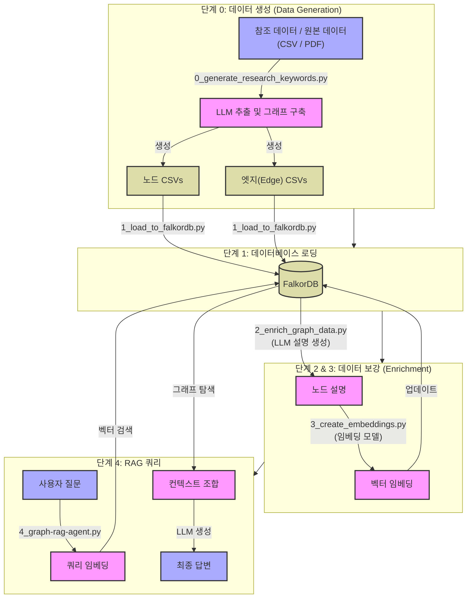

# FalkorDB GraphRAG 시스템

FalkorDB와 로컬 LLM을 활용한 지식 그래프 구축 및 질의응답을 위한 포괄적인 GraphRAG 시스템입니다.

## 📁 파일 구조

### 핵심 파이프라인 스크립트

**그래프 생성 (신규 - LLM 기반)**

1. **`0_graph_schema_discovery.py`** - 원본 데이터로부터 자동 그래프 생성
   - LLM을 사용하여 원본 데이터 분석
   - 노드/엣지 스키마 자동 발견
   - 엔티티 및 관계 추출
   - **자세한 내용은 `GRAPH_GENERATOR_README.md` 참조**

1. **`0_generate_research_keywords.py`** - 과학 논문 분석 및 그래프 구축
   - **정교한 그래프 구조**:
     - **Paper Nodes**: 각 문서를 대표하는 중심 허브.
     - **Structural Edges**: `(Paper)-[:HAS_PURPOSE]->(Purpose)`, `(Paper)-[:HAS_METHOD]->(Methodology)` 등.
     - **Semantic Edges**: `(Purpose)-[:RELATED_TO]->(Purpose)` (동일 유형 노드로 제한).
   - LLM을 사용하여 목적(Purpose), 배경(Background), 방법론(Methodology), 결과(Results) 추출.
   - 의미적 유사성을 위한 임베딩 생성.

**데이터 로딩 및 처리**

1. **`1_load_to_falkordb.py`** - FalkorDB로 데이터 로드
   - `data/csv/` 경로의 모든 CSV를 동적으로 로드.
   - `--graph` 및 `--clear` 인자 지원.
2. **`2_enrich_graph_data.py`** - 노드 설명 생성
   - LLM을 사용하여 노드에 대한 풍부한 설명 생성.
3. **`3_create_embeddings.py`** - 벡터 임베딩 생성
   - 벡터 검색을 위한 임베딩 생성 및 캐싱.

**RAG 및 분석**

1. **`4_graph-rag-agent.py`** - 대화형 GraphRAG 에이전트
   - **투명한 RAG**: 답변에 사용된 **출처 컨텍스트(Source Context)** (상위 3개 노드 및 엣지) 표시.
   - **하이브리드 검색**: 벡터 검색 + 그래프 탐색 (1-hop) 결합.
   - **대화형 CLI**: 지식 그래프와의 채팅 인터페이스.

1. **`5_analyze_network.py`** - 네트워크 분석
   - 연결 중심성(Degree Centrality), 영향력 점수(Influence Score) 등 계산.

### 유틸리티 스크립트

- **`enrich_export.py`** - 보강된 데이터 내보내기

## 🚀 빠른 시작 가이드 (Quick Start Guide)

### 필수 조건

### 0. 환경 설정

```bash
# 의존성 설치
pip install -r requirements.txt

# Ollama 설치 및 모델 풀링(pull)
ollama pull deepseek-r1:8b
ollama pull nomic-embed-text
```

### 1. 그래프 데이터 생성

```bash
# 옵션 A: 일반 데이터 (스키마 발견)
python 0_graph_schema_discovery.py

# 옵션 B: 과학 논문 (연구 키워드)
python 0_generate_research_keywords.py
```

### 2. 데이터베이스 로드

```bash
# FalkorDB에 데이터 로드 (이전 데이터 삭제 포함)
python 1_load_to_falkordb.py --clear --graph Paper_Keywords3
```

### 3. 보강 및 임베딩 (Enrich & Embed)

```bash
# 설명 생성 (선택 사항이지만 권장됨)
python 2_enrich_graph_data.py --graph Paper_Keywords3

# 임베딩 생성 (RAG에 필수)
python 3_create_embeddings.py --graph Paper_Keywords3
```

### 4. RAG 에이전트 실행

```bash
python 4_graph-rag-agent.py
```

### 5. 네트워크 분석

```bash
python 5_analyze_network.py --graph Paper_Keywords2
``` → 쿼리 및 답변

### 단계 0: 원본 데이터로부터 그래프 생성 (신규)

**모든 도메인에 대해 스키마를 자동으로 발견합니다!**

```bash
# 원본 데이터에서 노드/엣지 CSV 생성
python 0_graph_schema_discovery.py

# 또는 특정 파일 지정
python 0_graph_schema_discovery.py --file Rawdata/mycustom_data.csv

# 적은 행으로 빠른 테스트
# config.py 수정: MAX_ROWS_FOR_EXTRACTION = 20
python 0_graph_schema_discovery.py
```

**자세한 문서는 `GRAPH_GENERATOR_README.md`를 참조하세요.**

### 단계 1: FalkorDB 실행

```bash
# Docker로 FalkorDB 실행
docker run -p 6379:6379 -p 3001:3000 -it --rm falkordb/falkordb
```


### 단계 2: FalkorDB에 데이터 로드

```bash
# 생성된 CSV 파일을 FalkorDB에 로드 (기본 그래프: EnergyGraph)
python 1_load_to_falkordb.py

# 또는 사용자 지정 그래프 이름 지정
python 1_load_to_falkordb.py --graph Paper_Keywords

# 로드 전 기존 그래프 삭제
python 1_load_to_falkordb.py --graph Paper_Keywords --clear
```

### 단계 3: 설명을 통한 그래프 보강

**먼저 테스트:**

```bash
# 10개 샘플만 처리
python 2_enrich_graph_data.py --sample 10
```

**전체 처리:**

```bash
# 모든 노드 처리 (시간 소요됨)
python 2_enrich_graph_data.py --full
```

### 단계 4: 벡터 임베딩 생성

```bash
# 기본 그래프(EnergyGraph)에 대한 임베딩 생성
python 3_create_embeddings.py

# 특정 그래프에 대한 임베딩 생성
python 3_create_embeddings.py --graph Paper_Keywords
```

### 단계 5: GraphRAG로 쿼리하기

```bash
# 대화형 모드
python 4_graph_rag.py

# 직접 쿼리
python 4_graph_rag.py --query "지식 그래프란 무엇인가?"
```

### 단계 6: 네트워크 분석

```bash
# 기본 그래프(EnergyGraph) 분석
python 5_analyze_network.py

# 특정 그래프 분석
python 5_analyze_network.py --graph Paper_Keywords3
```

## 💡 사용 예시

### Python 코드에서 사용

```python
from graphrag_query import GraphRAG

# GraphRAG 초기화
rag = GraphRAG(graph_name='Paper_Keywords3')

# 질문하기
answer = rag.query("특허 인용 분석의 주요 목적은 무엇인가?")
print(answer)

# 상세 옵션으로 질문하기
answer = rag.query(
    "기술 융합 분석에 사용되는 방법론은 무엇인가?",
    top_k=5,           # 상위 5개 노드 검색
    verbose=True       # 검색 과정 출력
)
```

### 대화형 모드

```bash
python graphrag_query.py
```

```
💬 Question: 특허 네트워크 분석의 주요 응용 분야는 무엇인가?
🔍 Question: 특허 네트워크 분석의 주요 응용 분야는 무엇인가?
...
✅ Answer:
특허 네트워크 분석은 기술 트렌드 식별, 지식 흐름 매핑, 
혁신 패턴 발견 및 다양한 분야 간의 기술 융합 분석 등에 활용됩니다...
```

## 🔍 시스템 아키텍처 (System Architecture)

### 전체 파이프라인 (Complete Pipeline Code)



## ⚙️ 설정 (Configuration)

모든 설정은 `config.py`에서 중앙 관리됩니다:

```python
# 모델 설정
GRAPH_GENERATION_MODEL = 'gpt-oss:20b'  # 그래프 생성용

# --- 다음 모델 구성 중 하나를 선택하세요 ---

# 옵션 1: 로컬 Ollama 모델 (기본값)
LLM_MODEL = 'deepseek-r1:8b'
CHAT_MODEL = 'deepseek-r1:8b'

# 옵션 2: Ollama 클라우드 - DeepSeek v3.1
# LLM_MODEL = 'deepseek-v3.1:671b-cloud'
# CHAT_MODEL = 'deepseek-v3.1:671b-cloud'

# 옵션 3: Ollama 클라우드 - GPT-OSS
# LLM_MODEL = 'gpt-oss:120b-cloud'
# CHAT_MODEL = 'gpt-oss:120b-cloud'

EMBED_MODEL = 'nomic-embed-text:latest' # 임베딩용

# 성능 설정
BATCH_SIZE = 7
MAX_NODE_TYPES = 2
MAX_EDGE_TYPES = 2
MAX_ROWS_FOR_EXTRACTION = 10  # None = 모든 행, 또는 특정 숫자로 설정
MAX_TEXT_LENGTH = 200  # 긴 텍스트 자르기
```

**자세한 설정 옵션은 다음을 참조하세요:**

- `GRAPH_GENERATOR_README.md` - 그래프 생성 설정
- `README_OLLAMA.md` - Ollama 구성

## 📚 문서 (Documentation)

- **`GRAPH_GENERATOR_README.md`** - `0_generate_graph.py`에 대한 전체 가이드
- **`README_OLLAMA.md`** - Ollama 설정 및 로컬 LLM 사용법
- **`FILE_STRUCTURE.md`** - 상세 파일 구조 설명

## 📊 데이터 확인 (Check Data)

### FalkorDB UI 사용

브라우저에서 `http://localhost:3001` 접속

```cypher
// 설명(description)이 있는 Technology 노드 확인
MATCH (t:Technology) 
WHERE t.description IS NOT NULL 
RETURN t LIMIT 5

// 임베딩이 있는 노드 확인
MATCH (t:Technology) 
WHERE t.embedding IS NOT NULL 
RETURN t.name, t.description LIMIT 5

// 벡터 검색 테스트
CALL db.idx.vector.queryNodes('Technology', 'embedding', 3, [vector...]) 
YIELD node RETURN node
```

## 🐛 트러블슈팅 (Troubleshooting)

### "Ollama Connection Failed"

Ollama가 실행 중인지 확인하세요:

```bash
ollama serve
```

### "FalkorDB Connection Failed"

FalkorDB Docker 컨테이너가 실행 중인지 확인하세요:

```bash
docker ps | grep falkordb
```

### "No vector index found"

`create_embeddings.py`를 먼저 실행하세요.

## 💰 예상 비용 (Estimated Costs)

- **무료**: 로컬 Ollama 모델 사용 시.
- **하드웨어**: 로컬에서 LLM을 실행하기 위해 충분한 RAM(16GB+ 권장)이 필요합니다.

## 📚 추가 정보

- [FalkorDB 문서](https://docs.falkordb.com/)
- [Ollama 문서](https://ollama.com/)
- [GraphRAG 개념](https://www.microsoft.com/en-us/research/project/graphrag/)

## 🤝 기여 (Contribution)

이슈(Issues)를 통해 버그를 제보하거나 개선 사항을 제안해주세요!
